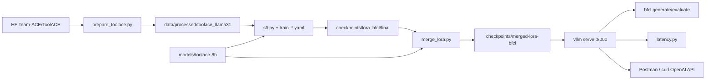

# Code-level guide — clone to running PoC

This document explains **what the repo is for**, **what you do after cloning**, and **which files/functions handle each assignment step**.

> **Critical:** Cloning on a laptop only gives you **code**. Training, BFCL, and vLLM need a **GPU machine** (Nebius 1×H100). Weights, processed data, and `.env` are **not** in git.

**Related docs:** [PRESENTATION.md](PRESENTATION.md) (demo story) · [REPORT.md](REPORT.md) (numbers) · [README.md](README.md) (short commands)

---

## 1. What this repo does (assignment → code)

| Assignment goal | Purpose in plain words | Code that does it |
| --- | --- | --- |
| Fine-tune on ToolACE | Turn HF ToolACE into BFCL-style train texts; run LoRA/QLoRA/full SFT | `src/data/prepare_toolace.py`, `src/train/sft.py`, `configs/train_*.yaml` |
| Multiple FT methods | Same trainer, different configs (`method: lora\|qlora\|full`) | `configs/train_lora.yaml`, `train_qlora.yaml`, `train_full.yaml`, `scripts/03_train.sh` |
| Evaluate BFCL Python | Hit local vLLM with official gorilla BFCL harness | `scripts/05_run_bfcl.sh`, `src/eval/run_bfcl.sh` |
| Deploy like Token Factory | OpenAI-compatible HTTP API on H100 | `scripts/04_serve_merged.sh`, `src/serve/run_vllm.sh`, `configs/serve.yaml` |
| Latency @ 16–32 concurrent | Measure TTFT / E2E | `src/bench/latency.py`, `configs/bench.yaml` |
| Merge adapter for prod serve | Bake LoRA into one HF folder | `src/train/merge_lora.py` |

---

## 2. Repo map (what lives where)

```
ml-ops/
├── configs/                 # Knobs only (paths, LR, serve flags) — no logic
│   ├── data.yaml            # ToolACE dataset + output dir
│   ├── train_lora.yaml      # Production LoRA (BFCL-aligned)
│   ├── train_qlora.yaml     # Method-matrix QLoRA
│   ├── train_full.yaml      # Optional full SFT
│   ├── serve.yaml           # vLLM defaults (docs / reference)
│   └── bench.yaml           # Latency concurrency levels
├── src/
│   ├── data/
│   │   └── prepare_toolace.py   # HF ToolACE → disk DatasetDict
│   ├── train/
│   │   ├── sft.py               # TRL SFTTrainer entrypoint
│   │   └── merge_lora.py        # Adapter → merged weights
│   ├── serve/
│   │   └── run_vllm.sh          # Generic vLLM launcher
│   ├── eval/
│   │   └── run_bfcl.sh          # Thin BFCL wrapper
│   └── bench/
│       └── latency.py           # Concurrent TTFT/E2E client
├── scripts/                 # Operator entrypoints (run these)
│   ├── 00_setup_vm.sh
│   ├── 01_download_assets.sh
│   ├── 02_prepare_data.sh
│   ├── 03_train.sh
│   ├── 04_serve_merged.sh       # Production serve (merged-lora-bfcl)
│   ├── 05_run_bfcl.sh
│   ├── 06_fix_accuracy_pipeline.sh  # Full fix path end-to-end
│   └── load_env.sh
├── data/processed/          # NOT in git — created by prepare
├── models/                  # NOT in git — downloaded weights
├── checkpoints/             # NOT in git — adapters / merges
└── results/                 # NOT in git — BFCL scores, latency.json
```

**Ignore for learning the main path:** `scripts/_diag_*`, `scripts/_ref_*`, `scripts/peek_*` (debug helpers from the accuracy investigation).

---

## 3. End-to-end data / control flow



---

## 4. Steps after `git clone` (with purpose + code)

### Step 0 — Clone (laptop or VM)

```bash
git clone https://github.com/AbdulWahabRaza123/nebius-toolace-llm-assignment.git
cd nebius-toolace-llm-assignment
```

**Purpose:** Get scripts/configs only.  
**Code involved:** none yet.

On laptop you can *read* everything. For the steps below, run on the **H100 VM** (or sync this repo to `~/ml-ops` as we did).

---

### Step 1 — Environment setup

```bash
cp .env.example .env   # set HF_TOKEN if you need gated Meta Llama
bash scripts/00_setup_vm.sh
source .venv/bin/activate
```

| Purpose | What the script does | Key lines / deps |
| --- | --- | --- |
| Create dirs | `models/`, `checkpoints/`, `data/processed/`, `logs/`, `results/` | `scripts/00_setup_vm.sh` |
| Install stack | venv, vLLM, `requirements.txt` (transformers, trl, peft, datasets, …) | same |
| Install BFCL | clones `~/gorilla`, `pip install -e …/berkeley-function-call-leaderboard` | same |

**Handled by:** `scripts/00_setup_vm.sh` only (orchestrator).

---

### Step 2 — Download assets

```bash
bash scripts/01_download_assets.sh
# Production backbone we actually used:
#   huggingface-cli download Team-ACE/ToolACE-8B --local-dir models/toolace-8b
```

| Purpose | Code |
| --- | --- |
| Pull ToolACE dataset (smoke) | inline Python in `01_download_assets.sh` via `datasets.load_dataset` |
| Pull base weights | `hf download` / `huggingface-cli download` into `models/` |

**Note:** Script still mentions Meta Llama; our production path uses **`models/toolace-8b`** (see train configs). Point downloads there if Meta is gated.

---

### Step 3 — Prepare training data (assignment quality lever)

```bash
bash scripts/02_prepare_data.sh
# or:
python src/data/prepare_toolace.py --config configs/data.yaml
```

| Purpose | Function / location |
| --- | --- |
| Load HF ToolACE | `main()` → `load_dataset(cfg["dataset_id"])` |
| Extract tool schemas from system text | `extract_tools_and_system()`, `find_json_array_span()` |
| Normalize schemas toward BFCL | `normalize_tool_bfcl()`, `rewrite_schema()` |
| Parse ToolACE call strings → `{"name","parameters"}` | `parse_call_list()`, `parse_one_call()`, `calls_to_assistant_content()` |
| Build chat messages | `convert_example()` |
| Train/val split + save Arrow dataset | `main()` → `DatasetDict.save_to_disk(.../toolace_llama31)` |
| Write stats | `data/processed/stats.json` |

**Config:** `configs/data.yaml` (`dataset_id`, `output_dir`, `val_ratio`, `seed`).

**Why it matters:** This is where train targets become BFCL-compatible JSON. Wrong prep → empty assistants → bad BFCL (the bug we fixed).

---

### Step 4 — Fine-tune (LoRA / QLoRA / full)

```bash
bash scripts/03_train.sh lora     # → configs/train_lora.yaml
bash scripts/03_train.sh qlora    # → configs/train_qlora.yaml
bash scripts/03_train.sh full     # → configs/train_full.yaml
# or:
python src/train/sft.py --config configs/train_lora.yaml
```

| Purpose | Function / location |
| --- | --- |
| Load YAML knobs | `load_config()` |
| Rebuild BFCL Llama 3.1 FC prompt text | **`render_bfcl_llama31()`** (core — matches BFCL handler layout) |
| Load base + optional 4-bit | `build_model()` — `BitsAndBytesConfig` if `method==qlora` |
| Attach LoRA | `LoraConfig` inside `build_model()` if `lora`/`qlora` |
| SFT loop | `main()` → HuggingFace/TRL `SFTTrainer` |
| Write adapter | `output_dir` from YAML, e.g. `checkpoints/lora_bfcl/final` |

**Config fields that decide “which method”:**

- `method: lora | qlora | full`
- `base_model: models/toolace-8b`
- `data_dir: data/processed` (loads `toolace_llama31`)
- `lora.r / alpha / target_modules`

**One trainer, three recipes** — that is how “experiment with different fine-tuning methods” is implemented.

---

### Step 5 — Merge LoRA for production serve

```bash
python src/train/merge_lora.py \
  --base-model models/toolace-8b \
  --adapter checkpoints/lora_bfcl/final \
  --output checkpoints/merged-lora-bfcl
```

| Purpose | Code |
| --- | --- |
| Load base + PEFT adapter, merge, save full HF model | `src/train/merge_lora.py` → `main()` |

**Why:** vLLM / Token Factory–style deploy prefers a single merged checkpoint, not a live adapter.

---

### Step 6 — Deploy (Token Factory analogue)

```bash
bash scripts/04_serve_merged.sh
```

| Purpose | Code |
| --- | --- |
| Kill old server, start vLLM | `scripts/04_serve_merged.sh` |
| Bind all interfaces (Postman over network) | `--host 0.0.0.0 --port 8000` |
| OpenAI chat + native tools | `--enable-auto-tool-choice --tool-call-parser llama3_json` |
| BF16, 32k context, prefix cache | flags in same script / `configs/serve.yaml` |

**Served model name:** `llama-3.1-8b-toolace`  
**Public test URL (current VM):** `http://89.169.99.143:8000/v1/chat/completions`

Generic alternate launcher: `src/serve/run_vllm.sh <model_path> <served_name>`.

---

### Step 7 — BFCL Python evaluation

```bash
# vLLM must already be up
bash scripts/05_run_bfcl.sh
```

| Purpose | Code |
| --- | --- |
| Point BFCL at local vLLM | env `LOCAL_SERVER_ENDPOINT/PORT`, `--skip-server-setup` |
| Generate on Python subset | `bfcl generate --model … --test-category python --backend vllm` |
| Score | `bfcl evaluate …` |
| Save scores | `results/bfcl/score/*.csv` |

Model id is often `meta-llama/Llama-3.1-8B-Instruct-FC` while weights are the merged checkpoint — BFCL’s FC handler name; vLLM aliases include that family via `--served-model-name`.

---

### Step 8 — Latency benchmark (16–32 concurrent)

```bash
python src/bench/latency.py --config configs/bench.yaml
```

| Purpose | Code |
| --- | --- |
| Fire N concurrent chat/tool requests | `src/bench/latency.py` |
| Compute TTFT / E2E percentiles + RPS | `percentile()`, run loop in `main()` |
| Write JSON | `results/latency.json` (path from config) |

**Config:** `configs/bench.yaml` — endpoint, model name, concurrency list `[1,8,16,32]`.

---

### Optional — one-shot “accuracy fix” pipeline

```bash
bash scripts/06_fix_accuracy_pipeline.sh
```

Runs prepare → LoRA → merge → serve → BFCL in order. This is the **operator path** that recovered ~71% BFCL after the empty-target bug.

---

## 5. Deep dive: the two most important modules

### A. `src/data/prepare_toolace.py` — “make labels the judge understands”

1. `convert_example` walks ToolACE `conversations`.
2. Assistant turns that look like tool calls are parsed into BFCL JSON (`name` + `parameters`).
3. Tools are pulled from the system blob with bracket matching (not fragile regex alone).
4. Everything is stored as `messages_json` / `tools_json` strings (Arrow-safe).

If you change eval format, **change this file first**, then retrain.

### B. `src/train/sft.py` — “teach the model that format”

1. `render_bfcl_llama31` builds the **exact** Llama 3.1 FC prompt shape BFCL uses (system + tool list on first user turn + assistant JSON).
2. Empty assistant renders return `""` and are filtered — prevents training EOS-only.
3. `build_model` switches LoRA vs QLoRA via config; TRL does the rest.

Training loss alone is not enough; this render must match BFCL or scores stay low.

---

## 6. Config cheat sheet

| File | Controls |
| --- | --- |
| `configs/data.yaml` | Which HF dataset, where to write processed data |
| `configs/train_lora.yaml` | Production recipe → `checkpoints/lora_bfcl` |
| `configs/train_qlora.yaml` | 4-bit comparison → `checkpoints/qlora_bfcl` |
| `configs/train_full.yaml` | Full SFT → `checkpoints/full_bfcl` |
| `configs/serve.yaml` | Documented serve defaults |
| `configs/bench.yaml` | Latency endpoint + concurrency |

Change **configs**, not Python, for LR / epochs / paths. Change **Python** for format / BFCL alignment.

---

## 7. What is *not* in the clone (and how you get it)

| Artifact | How it appears |
| --- | --- |
| `.venv/` | `00_setup_vm.sh` |
| `models/toolace-8b/` | HF download |
| `data/processed/toolace_llama31/` | `prepare_toolace.py` |
| `checkpoints/lora_bfcl/`, `merged-lora-bfcl/` | `sft.py` + `merge_lora.py` |
| `results/bfcl/`, `results/latency.json` | BFCL + bench scripts |
| `.env` / `HF_TOKEN` | you create locally |

---

## 8. Minimal “I cloned, I want to understand / re-run” checklist

On **H100**:

1. `bash scripts/00_setup_vm.sh`
2. Download `Team-ACE/ToolACE-8B` → `models/toolace-8b`
3. `python src/data/prepare_toolace.py --config configs/data.yaml`
4. `python src/train/sft.py --config configs/train_lora.yaml`
5. `python src/train/merge_lora.py --base-model models/toolace-8b --adapter checkpoints/lora_bfcl/final --output checkpoints/merged-lora-bfcl`
6. `bash scripts/04_serve_merged.sh`
7. Postman/curl → `http://<VM_IP>:8000/v1/chat/completions`
8. `bash scripts/05_run_bfcl.sh`
9. `python src/bench/latency.py --config configs/bench.yaml`

On **laptop only:** read `PRESENTATION.md` + this file; run nothing GPU-heavy.

---

## 9. Quick “who do I edit?” guide

| If you want to… | Edit |
| --- | --- |
| Change train format / BFCL JSON shape | `src/data/prepare_toolace.py` + `render_bfcl_llama31` in `sft.py` |
| Change LoRA rank / LR / epochs | `configs/train_lora.yaml` (or qlora/full) |
| Change serve context / tool parser | `scripts/04_serve_merged.sh` |
| Change latency concurrencies | `configs/bench.yaml` |
| Change BFCL category / model id | `scripts/05_run_bfcl.sh` |
| Re-run entire accuracy path | `scripts/06_fix_accuracy_pipeline.sh` |

---

## 10. Production path we actually shipped

| Stage | Artifact |
| --- | --- |
| Data | `data/processed/toolace_llama31` (BFCL JSON assistants) |
| Train | `checkpoints/lora_bfcl/final` |
| Deploy weights | `checkpoints/merged-lora-bfcl` |
| API name | `llama-3.1-8b-toolace` |
| Eval | BFCL Python → ~71% non-live / live (see REPORT) |

QLoRA lives at `checkpoints/qlora_bfcl/final` for the **method comparison**, not the default serve target.
